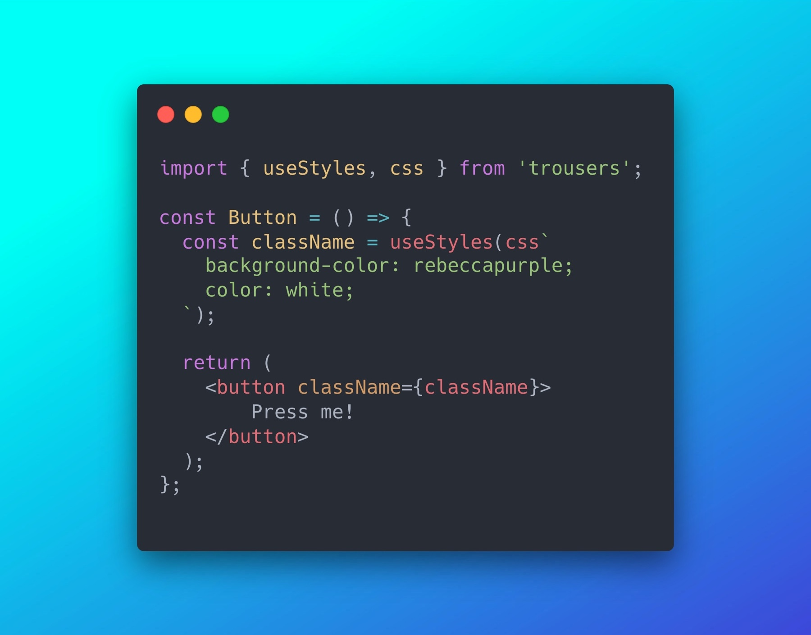

<p align="center">
  
</p>

# Trousers 👖

[](https://opencollective.com/trousers) [](https://www.npmjs.com/package/trousers)
[](https://www.npmjs.com/package/trousers)
[](https://www.npmjs.com/package/trousers)

React components are more stylish with Trousers!

[Try it here](https://danieldelcore.github.io/trousers/)

Trousers is a [hooks-first](https://reactjs.org/docs/hooks-overview.html) CSS-in-JS library, designed to help developers author React apps with performant and semantic CSS. It is heavily influenced by the conventions introduced by [BEM](http://getbem.com/introduction/), borrowing the concept of Blocks (the component), Elements (children nodes) and Modifiers (styles as a function of state). Through this API, Trousers encourages semantic organisation of styles without inadvertently increasing the runtime implications often associated with CSS-in-JS libraries.

<p align="center">
  
</p>

## Get started 🏗

**Installation**

`npm install --save trousers` or `yarn add trousers`

**Basic example**

A basic purple button:

```jsx
import { css, useStyles } from 'trousers';

const Button = props => {
    const className = useStyles(css`
        background-color: rebeccapurple;
        color: white;
    `);

    return <button className={className}>{props.children}</button>;
};

export default Button;
```

**Complete example**

A themed button with a _primary_ variant:

`app/components/button.jsx`

```jsx
import { styleCollector, useStyles } from 'trousers';

const styles = styleCollector('button').element`
        background-color: ${theme => theme.backgroundColor};
        border: none;
        color: ${theme => theme.textColor};
        margin: 0 10px;
        padding: 10px 20px 14px 20px;

        :hover {
            background-color: ${theme => theme.hoverColor};
            color: rgba(255, 255, 255, 0.8);
        }
    `.modifier('primary', props => !!props.primary)`
        background-color: #f95b5b;
        color: #ffffff;

        :hover {
            background-color: #e45454;
        }
    `;

const Button = props => {
    const buttonClassNames = useStyles(styles, props);

    return <button className={buttonClassNames}>{props.children}</button>;
};

export default Button;
```

`app/MyApp.jsx`

```jsx
import { ThemeProvider } from 'trousers';

import Button from './components/button';

const theme = {
    backgroundColor: 'blue',
    textColor: 'white',
    hoverColor: 'lightblue',
};

const MyApp = props => {
    return (
        <ThemeProvider theme={theme}>
            <Button primary>How do I look?</Button>
        </ThemeProvider>
    );
};

export default Button;
```

## Motivation 🧠

Components often require many **variations** and **states** to be flexible and truly reusable. Think about a _simple_ Button, it can have variations like `primary`, `secondary`, `subtle` and each variation has it's own states, `clicked`, `hover`, `loading`. But with modern CSS-in-JS libraries it can be hard to represent these variations and states in a way that makes sense to everyone and is repeatable without having to memorise specific syntax.

Consider this example:

```jsx
const Button = styled.button`
    background: ${props => (props.primary ? 'palevioletred' : 'white')};
    color: ${props => (props.primary ? 'white' : 'palevioletred')};
    margin: 1em;
    padding: 0.25em 1em;
    border: 2px solid palevioletred;
`;
```

We have a button with two variants, `default` and `primary`. Functionally it works, but semantically it's really hard to see at a glance what color will be applied when it's primary. How would we extend this further, if say, we wanted primary buttons to have a `disabled` state?

What's more, for every permutation of props, a new class will be created and attached to the `<head>`. Every class that is created incurs additional runtime cost, this can **grow exponentially** if you're not careful, resulting in a combinatorial explosion of classnames 💥. Consider a component with 3 variants and 3 possible states, that is 3 x 3 = 9, 9 eventual classes generated for one component. It doesn't scale, but we could take another approach:

```jsx
const Button = styled.button`
  background: white;
  color: palevioletred;
  margin: 1em;
  padding: 0.25em 1em;
  border: 2px solid palevioletred;

  ${props => props.primary && css`
    background: palevioletred;
    color: white;
  `}
}
```

Now that's more like it! This can be extended and scales to many variations and states. 

I think [@MadeByMike](https://github.com/MadeByMike) articulated this perfectly in: [CSS Architecture for Modern JavaScript Applications](https://www.madebymike.com.au/writing/css-architecture-for-modern-web-applications/) 👌

> BEM gave semantic meaning to classnames and one of the biggest unseen values in this was we could immediately transfer our intentions to other developers across teams and even projects. If you know BEM you can look at a classname, e.g. `button--state-success` and immediately recognise this as a modifier for a button class.

But there's still a problem, this syntax has to be memorised and there's nothing stopping you from falling back into the previous example. This is where an abstraction can protect us and scale that knowledge across your codebase. This is where Trousers can help 🎉...

Using our style collector you can express these variants and states like so:

```jsx
import { styleCollector, useStyles } from 'trousers';

const styles = styleCollector('button')
    .element` 
        // Base styles applied to all buttons
        color: white;
    `.modifier('primary', props => !!props.primary)`  
        // A modifier for the primary variant
        color: black;
    `.modifier('secondary', props => !!props.secondary)`
        color: blue;
    `.modifier('subtle', props => !!props.subtle)`
        color: blue;
    `;

const Button = props => {
    const classNames = useStyles(styles, props);

    return <button className={buttonClassNames}>{props.children}</button>;
};

export default Button;

```

In this scenario, Trousers will only ever mount 3 classes to the `<head>` and toggle them on and off using the predicates provided to the style collector. It will only ever mount what it needs so, if a `subtle` button is never used you wont pay the run-time cost of processing and mounting those styles. 

Under the hood, style collectors are simply an array of styles. This opens the door to a lot of possibilites because it is possible to **create your own style collectors** that suit your specific needs. What if you want a state machine style collector? Or a style collector that accepts objects instead of template literals? You can simply define one and pass it straight into Trouses 😲!

## Features ✨

### Hooks-first API

[Hooks are a (relatively) hot new feature in React](https://reactjs.org/docs/hooks-intro.html), which allows Trousers to access context and state while abstracting the messy details away from the consumer.
Our `useStyles` hook accepts a name, some props and an instance of `styleCollector()`. It will then evaluate everything for you and return a human-readable class name, which you can then apply to your desired element.
For example, here we define a style for the button and inner span and apply the resulting classes to their respective elements.

```jsx
const Button = props => {
    const buttonClassNames = useStyles(buttonStyles, props);
    const spanClassNames = useStyles(spanStyles, props);

    return (
        <button className={buttonClassNames}>
            <span className={spanClassNames}>{props.children}</span>
        </button>
    );
};
```

### Theme Support

Theming is achieved via React's Context API, which provides a lot of flexibility. You can even choose to nest themes and present a section of your app in a different way.
It looks a little something like this:

```jsx
import { ThemeProvider } from 'trousers';

const lightTheme = {
    primaryColor: 'white',
    secondaryColor: 'blue',
    disabledColor: 'grey',
};

const darkTheme = {
    primaryColor: 'black',
    secondaryColor: 'purple',
    disabledColor: 'grey',
};

const MyApp = () => {
    return (
        <ThemeProvider theme={lightTheme}>
            <h1>Hello World</h1>
            <p>Rest of my app lives here and has access to the light theme!</p>
            <ThemeProvider theme={darkTheme}>
                <p>This subtree will have access to the dark theme!</p>
            </ThemeProvider>
        </ThemeProvider>
    );
};
```

When a Trousers component is mounted within a new theme context, it will render new styles and apply them to the component.

You can define how your component handles themes like this:

```jsx
const buttonStyles = styleCollector('button').element`
        background-color: ${theme => theme.secondaryColor};
    `.modifier(props => props.primary)`
        background-color: ${theme => theme.primaryColor};
    `.modifier(props => props.disabled)`
        background-color: ${theme => theme.disabledColor};
    `;
```

Now your component will render different styles based on the context it is mounted in.

### Global styles

Every app needs _some_ form of global styling in order to import fonts or reset native styling, for example using [@font-face](https://developer.mozilla.org/en-US/docs/Web/CSS/@font-face) would be quite challenging to use without access to globals.

Turns out that there's a hook for that, `useGlobals`:

```jsx
import React, { useEffect } from 'react';
import { css, useGlobals } from 'trousers';

const globalStyles = css`
  @font-face {
    font-family: MyFont;
    src: url('${MyFont}') format('opentype');
  }
`;

const App = () => {
    useGlobals(globalStyles);

    return <h1>Welcome to my website!</h1>;
};
```

### Server side rendering (SSR)

Server side rendering with Trousers follows a similar approach to [styled-components](https://www.styled-components.com/docs/advanced#server-side-rendering). It works by firstly instantiating a `serverStyleRegistry`, wrapping your application in a `ServerProvider`, then passing that registry into the provider as a prop. Then when you render your application to a string with `react-dom/server`, Trousers will push styles into the style registry. You can then pull the styles from the registry and manually append them to the head of your document.

```jsx
import React, { FC, ReactNode } from 'react';
import { renderToString } from 'react-dom/server';

import { ServerStyleRegistry, ServerProvider } from 'trousers';
import App from './';

const registry = new ServerStyleRegistry();

const html = renderToString(
    <ServerProvider registry={registry}>
        <App />
    </ServerProvider>,
);

// Your styles will be accessible here
const styleTags = registry.get();
```

## API 🤖

### `styleCollector()`

The `styleCollector()` function is designed to collect style definitions and provide some portability. If you deside to define CSS in another file, you can do and re-import it into your component.

> NOTE! styleCollector return methods will always return `this`, which means the calls can be chained repeatedly.

**Arugments:**

-   `componentName`: String

**Returns:**

-   `styleCollector().element`
-   `styleCollector().modifier(predicate)`
-   `styleCollector().get()`

### `styleCollector().element`

A function which accepts a [Tagged Template](https://developer.mozilla.org/en-US/docs/Web/JavaScript/Reference/Template_literals#Tagged_templates).

You should treat element blocks like you would with [Elements in BEM](https://en.bem.info/methodology/quick-start/#element).

-   The element name describes its purpose ("What is this?" — item, text, etc.), not its state ("What type, or what does it look like?" — red, big, etc.).
-   The structure of an element's full name is block-name**element-name. The element name is separated from the block name with a double underscore (**).
-   The block name defines the namespace, which guarantees that the elements are dependent on the block (block\_\_elem)
-   A block can have a nested structure of elements in the DOM tree

**Arugments:**

-   `taggedTemplate`: TaggedTemplate

**Example:**

```jsx
import { styleCollector } from 'trousers';

const styles = styleCollector('button').element`
        background-color: red;
    `;
```

### `styleCollector().modifier(modifierName, predicate)`

A function that accepts a predicate function or boolean and returns a new function which accepts a tagged template. The tagged template will only be rendered if the predicate returns a truthy value.

> Note: Modifiers are dependant on order. Be sure to organise the order of your modifiers with the understanding that the bottom most modifier will potentially be overriding the style rules defined in the modifiers and elements declared before it.

Modifiers follow the same methodology as [Modifiers in BEM](https://en.bem.info/methodology/quick-start/#modifier).

-   Defines the appearance, state, or behavior of a block or element
-   A modifier can't be used alone, a modifier can't be used in isolation from the modified block or element. A modifier should change the appearance, behavior, or state of the entity, not replace it
-   You can have one or multiple modifiers active at any time
-   The modifier name describes its appearance ("What size?" or "Which theme?" and so on — size_s or theme_islands), its state ("How is it different from the others?" — disabled, focused, etc.) and its behavior ("How does it behave?" or "How does it respond to the user?" — such as directions_left-top)

**Arguments:**

-   `modifierName`: (optional) string
-   `predicate`: boolean | Function(props, state) => boolean

**Returns:**

-   `Function(TaggedTemplate)`

**Example:**

```jsx
import { styleCollector } from 'trousers';

const styles = styleCollector('button').element``.modifier(props => {
    return props.primary;
})`
        background-color: yellow;
    `.modifier('active', (props, state) => {
    return state.isActive;
})`
        background-color: purple;
    `.modifier('disabled', props => {
    return props.isDisabled;
})`
        background-color: grey;
    `;
```

### `styleCollector().get()`

Outputs the collected `styleDefinitions`. StyleDefintions is an array of objects that trousers passes around internally.

**StyleDefinition:**

```
{
    styles: TemplateStringsArray;
    expressions: number | string | Function(props) => number | string;
    predicate?: Predicate<Props>;
}
```

**Returns:**

-   `styleDefinitions`: StyleDefinition[];

**Example:**

```jsx
import { styleCollector } from 'trousers';

const styles = styleCollector('button')
    .element``
    .modifier(...)``;

styles.get();
```

### `useStyles()`

React Hook responsbile for evaluating the supplied styles, attaching them to the document head and returning all active classes for the current state.

**Arguments:**

-   `styleCollector`: StyleCollector
-   `props`?: Object
-   `state`?: Object

**Returns:**

-   `className`: string

**Example:**

```jsx
import React from 'react';
import { styleCollector, useStyles } from 'trousers';

const styles = styleCollector('button')
    .element``
    .modifier(...)``;

const Button = props => {
    const classNames = useStyles(styles, props);

    return (
        <button className={classNames}>
            Submit
        </button>
    );
};
```

### `withStyles`

A [HOC (Higher Order Component)](https://reactjs.org/docs/higher-order-components.html) which accepts a component and a style collector. Returns a new component, with the supplied styles rendered and passed down to via a `className` prop.

Use this HOC in your class components, where hooks (and useStyles) are not available.

> Note: Remember to apply the supplied className prop to an element in your components render funciton or your styling wont be applied to your element!

**Arguments:**

-   `Component`: React Component
-   `styleCollector`: StyleCollector

**Example:**

```jsx
import React from 'react';
import { styleCollector, withStyles } from 'trousers';

const styles = styleCollector('button')
    .element``
    .modifier(true)``;

class Button {
    render() {
        return (
            // IMPORTANT: apply the className yourself
            <button className={this.props.className}>
                Submit
            </button>
        )
    }
);

export default withStyles(Button, styles);
```

### `<ThemeProvider />`

Responsible for pushing the supplied theme into React's Context API.

**Props:**

-   `theme`: Object

**Example:**

```jsx
import React from 'react';
import { ThemeProvider } from 'trousers';

const theme = {
    primaryColor: 'red',
    secondaryColor: 'blue',
};

const App = () => (
    <ThemeProvider theme={theme}>
        {* Every child node will have access to the theme *}
    </ThemeProvider>
);
```

### `css`

Single style defintion

**Arugments:**

-   `taggedTemplate`: TaggedTemplate

**Example:**

```jsx
import { css } from 'trousers';

const styles = css`
    background-color: red;
`;
```

### `useGlobals()`

Mount a single style definition as a global style

**Arguments:**

-   `styleCollector`: SingleStyleCollector | SingleStyleCollector[]

**Returns**

-   void

**Example:**

```jsx
import React, { useEffect } from 'react';
import { css, useGlobals } from 'trousers';

const globalStyles = css`
  @font-face {
    font-family: MyFont;
    src: url('${MyFont}') format('opentype');
  }
`;

const App = () => {
    useGlobals(globalStyles);

    return <h1>Welcome to my website!</h1>;
};
```

`useGlobals` also accepts an array of styles...

```jsx
import React, { useEffect } from 'react';
import { css, useGlobals } from 'trousers';

const globalStyles = css`...`;
const moreGlobalStyles = css`...`;

const App = () => {
    useGlobals([globalStyles, moreGlobalStyles]);

    return <h1>Welcome to my website!</h1>;
};
```

### `withGlobals`

A [HOC (Higher Order Component)](https://reactjs.org/docs/higher-order-components.html) which accepts a component and a single style collector. Returns a new component, with the supplied global styles rendered to the document head.

Use this HOC in your class components, where hooks (and useGlobals) are not available.

**Arguments:**

-   `Component`: React Component
-   `css`: SingleStyleCollector

**Example:**

```jsx
import React from 'react';
import { css, withGlobals } from 'trousers';

class Button {
    render() {
        return (
            <button>
                Submit
            </button>
        )
    }
);

export default withGlobals(Button, css`
    * {
        box-sizing: border-box;
    }
`);
```

### `ServerStyleRegistry`

A style registry **for use on the server**

**Example:**

```jsx
import { ServerStyleRegistry, ServerProvider } from 'trousers';

const registry = new ServerStyleRegistry();
const styleTags = registry.get();
```

### `ServerProvider`

A context provider which tells Trousers to push styles into the supplied registry, rather than `document.head`. **For use on the server.**

**Props:**

-   `registry`: SeverStyleRegistry()
-   `children`: ReactChildren

**Example:**

```jsx
import React, { FC, ReactNode } from 'react';
import { renderToString } from 'react-dom/server';

import { ServerStyleRegistry, ServerProvider } from 'trousers';
import App from './';

const registry = new ServerStyleRegistry();

const html = renderToString(
    <ServerProvider registry={registry}>
        <App />
    </ServerProvider>,
);

const styleTags = registry.get();
```

## FAQ 🤷‍♀️

**Can't you do this in styled-components and emotion?**

This can most certainly be done in styled-components and emotion! They are both great libraries, packed with loads of features. Trousers on the other hand, aims to be a little more simple and opinionated, it urges you to be deliberate about how styles are defined for particular states so that they can be clearer and more maintainable.

**What does this have to do with hooks? Can we not compute the classname from a plain-old JS function?**

The reason Trousers is a hook was so it could access (consume) the context from within the library, without exposing that implementation detail to the user. Otherwise you would have to wrap or access the context manually and pass it into Trousers.
There are also plans on leverage hooks more down the line to enable a few new features.

## Backers

Thanks goes to all our backers! [[Become a backer](https://opencollective.com/trousers#backer)].

<a href="https://opencollective.com/trousers#backers">
    
</a>

## Resources

-   [CSS Architecture for Modern JavaScript Applications](https://www.madebymike.com.au/writing/css-architecture-for-modern-web-applications/)
-   [CSS Evolution](https://medium.com/@perezpriego7/css-evolution-from-css-sass-bem-css-modules-to-styled-components-d4c1da3a659b)
-   [BEM](https://en.bem.info/)
-   [BEM - Block Element Modifier](http://getbem.com/introduction/)
-   [How styled-components works](https://medium.com/styled-components/how-styled-components-works-618a69970421)
-   [Tagged Templates](https://developer.mozilla.org/en-US/docs/Web/JavaScript/Reference/Template_literals#Tagged_templates)
-   [Creating a TypeScript library with minimal setup](https://michalzalecki.com/creating-typescript-library-with-a-minimal-setup/)

## Tools

-   [Stylis – a light weight css preprocessor ](https://github.com/thysultan/stylis.js)

## Contributors

### Code Contributors

This project exists thanks to all the people who contribute. [[Contribute](CONTRIBUTING.md)].
<a href="https://github.com/danieldelcore/trousers/graphs/contributors"></a>

### Financial Contributors

Become a financial contributor and help us sustain our community. [[Contribute](https://opencollective.com/trousers/contribute)]

#### Individuals

<a href="https://opencollective.com/trousers"></a>

#### Organizations

Support this project with your organization. Your logo will show up here with a link to your website. [[Contribute](https://opencollective.com/trousers/contribute)]

<a href="https://opencollective.com/trousers/organization/0/website"></a>
<a href="https://opencollective.com/trousers/organization/1/website"></a>
<a href="https://opencollective.com/trousers/organization/2/website"></a>
<a href="https://opencollective.com/trousers/organization/3/website"></a>
<a href="https://opencollective.com/trousers/organization/4/website"></a>
<a href="https://opencollective.com/trousers/organization/5/website"></a>
<a href="https://opencollective.com/trousers/organization/6/website"></a>
<a href="https://opencollective.com/trousers/organization/7/website"></a>
<a href="https://opencollective.com/trousers/organization/8/website"></a>
<a href="https://opencollective.com/trousers/organization/9/website"></a>
